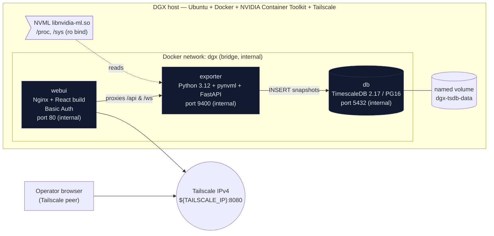
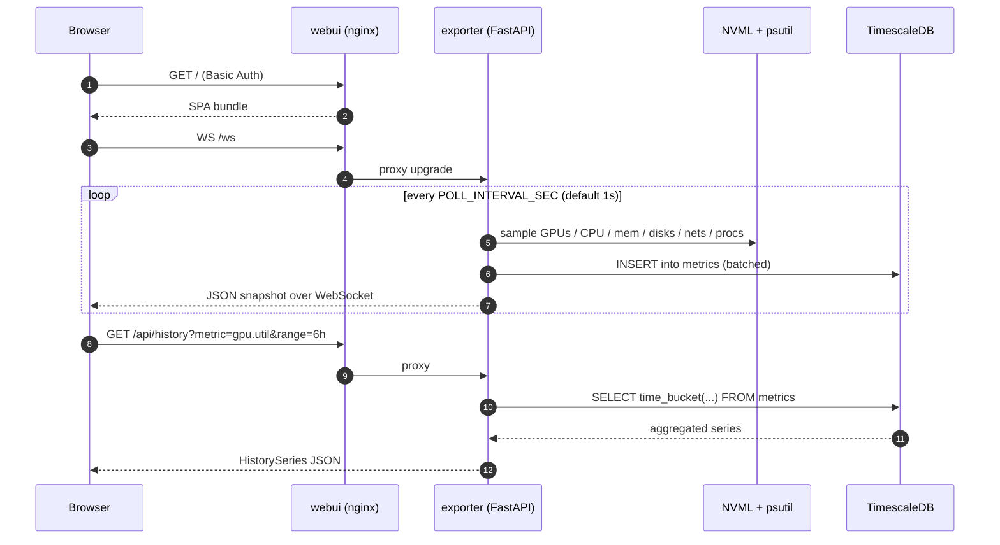

# AGENT.md — tonic-dgxtop-web Deployment Runbook

> **Audience:** autonomous AI agents (Claude Code, Codex, etc.) executing on the target DGX host.
> **Purpose:** deterministic install, upgrade, backup, restore, and diagnostics for the `tonic-dgxtop-web` stack.
> **Contract:** every command block is copy-paste executable, exit-code-checked, and idempotent unless explicitly marked otherwise.

---

## 0. Metadata (machine-readable)

```yaml
project: tonic-dgxtop-web
version: 0.1.0
repo: https://github.com/tonylnng/dgxtop
branch: feat/web-ui        # merge to main after first successful deploy
subpath: tonic-dgxtop-web
runtime:
  os: ubuntu-22.04-or-24.04
  arch: [x86_64, aarch64]
  requires:
    - docker-engine>=24
    - docker-compose-plugin>=2.20
    - nvidia-container-toolkit
    - tailscale
services:
  - id: db
    image: timescale/timescaledb:2.17.2-pg16
    ports_internal: [5432]
    ports_published: []
  - id: exporter
    image_local: dgxtop-exporter:latest
    build_context: ./exporter
    ports_internal: [9400]
    ports_published: []
    gpu: true
    pid_host: true
  - id: webui
    image_local: dgxtop-webui:latest
    build_context: ./webui
    ports_internal: [80]
    ports_published: ["${TAILSCALE_IP}:8080:80"]
env_required:
  - TAILSCALE_IP           # e.g. 100.x.y.z
  - BASIC_AUTH_USER
  - BASIC_AUTH_PASSWORD
  - POSTGRES_PASSWORD
env_file: .env
volumes:
  - name: dgx-tsdb-data
    driver: local
    mount: /var/lib/postgresql/data
health:
  webui:    "curl -fsS http://${TAILSCALE_IP}:8080/healthz"
  exporter: "docker compose exec -T exporter curl -fsS http://localhost:9400/healthz"
  db:       "docker compose exec -T db pg_isready -U dgx -d dgxtop"
```

---

## 1. Background

`tonic-dgxtop-web` is a browser-based observability dashboard for NVIDIA DGX systems. It complements — but does not replace — the [`dgxtop`](https://github.com/tonylnng/dgxtop) Rust TUI. The stack persists 24 h of high-frequency telemetry and streams live updates to authorized users on the operator's Tailscale network.

Design invariants:

1. **Zero host installs.** All runtime code (Python, Node build, Postgres) is inside containers. Host requires only Docker, NVIDIA Container Toolkit, and Tailscale.
2. **No public exposure.** The web port is bound to the Tailscale IPv4 address only. Exporter and DB ports are never published.
3. **Basic Auth at the edge.** Nginx enforces HTTP Basic Auth using an htpasswd file regenerated from environment variables at every container start.
4. **Single source of truth for secrets.** All secrets live in `.env` (git-ignored, chmod 600). Rotation is a compose recreate.
5. **TimescaleDB for history.** One wide hypertable `metrics(ts, metric, gpu_index, device, value)` with 25 h retention and a 1-minute continuous aggregate.

---

## 2. Architecture

### 2.1 Component topology



### 2.2 Deployment sequence (agent's happy path)

```mermaid
sequenceDiagram
    autonumber
    participant A as AI agent (on DGX)
    participant H as host shell
    participant G as GitHub
    participant D as docker daemon
    participant N as NVIDIA runtime
    participant T as Tailscale

    A->>H: preflight checks (docker, nvidia-ctk, tailscale)
    H-->>A: versions & IPs
    A->>T: tailscale ip -4
    T-->>A: TAILSCALE_IP
    A->>G: git clone tonylnng/dgxtop; checkout feat/web-ui
    G-->>A: repo @ tonic-dgxtop-web/
    A->>H: write .env (secrets + TAILSCALE_IP)
    A->>D: docker compose build
    D-->>A: images: dgx-exporter, dgx-webui
    A->>D: docker compose up -d
    D->>N: create exporter with GPU passthrough
    A->>H: poll healthchecks until all green
    H-->>A: db ok, exporter ok, webui ok
    A->>T: curl http://TAILSCALE_IP:8080/healthz
    T-->>A: 200 OK
```

### 2.3 Runtime data flow



---

## 3. Preflight (agent must verify all of these pass)

```bash
# 3.1 Docker engine present and daemon reachable
docker version --format '{{.Server.Version}}'                        # expect: >=24
docker compose version --short                                        # expect: >=2.20

# 3.2 NVIDIA Container Toolkit and GPU visibility
nvidia-ctk --version                                                  # expect: exit 0
docker run --rm --gpus all nvidia/cuda:12.4.1-base-ubuntu22.04 nvidia-smi | head -3
# ^ expect a table with your GPUs. If it fails, do not proceed.

# 3.3 Tailscale up and IPv4 assigned
tailscale status --peers=false | head -3                              # expect: "logged in"
TAILSCALE_IP=$(tailscale ip -4 | head -1)
[[ "$TAILSCALE_IP" =~ ^100\. ]] || { echo "no Tailscale IPv4"; exit 1; }
echo "TAILSCALE_IP=$TAILSCALE_IP"

# 3.4 Port 8080 free on the Tailscale interface
ss -ltn "src ${TAILSCALE_IP}:8080" | wc -l                            # expect: 1 (header only)

# 3.5 Working directory and git available
command -v git >/dev/null
DEPLOY_DIR="${DEPLOY_DIR:-/opt/tonic-dgxtop-web}"
sudo mkdir -p "$DEPLOY_DIR" && sudo chown "$USER:$USER" "$DEPLOY_DIR"
```

**Failure policy:** If any preflight check exits non-zero, the agent must stop, capture stderr, and report to the operator. Do not attempt to install prerequisites automatically unless explicitly authorized.

---

## 4. Installation Procedure

### 4.1 Fetch source

```bash
cd "$DEPLOY_DIR"
if [[ ! -d dgxtop/.git ]]; then
  git clone https://github.com/tonylnng/dgxtop.git
fi
cd dgxtop
git fetch origin
git checkout feat/web-ui           # switch to main after PR is merged
git pull --ff-only
cd tonic-dgxtop-web
```

### 4.2 Generate `.env`

Agent must generate strong passwords and write them exactly once. If `.env` already exists, do **not** overwrite — read and reuse.

```bash
set -euo pipefail
umask 077

if [[ ! -f .env ]]; then
  BASIC_AUTH_USER="${BASIC_AUTH_USER:-admin}"
  BASIC_AUTH_PASSWORD="${BASIC_AUTH_PASSWORD:-$(openssl rand -base64 24 | tr -d '=+/')}"
  POSTGRES_PASSWORD="${POSTGRES_PASSWORD:-$(openssl rand -base64 24 | tr -d '=+/')}"
  TAILSCALE_IP="${TAILSCALE_IP:-$(tailscale ip -4 | head -1)}"

  cat > .env <<EOF
TAILSCALE_IP=${TAILSCALE_IP}
BASIC_AUTH_USER=${BASIC_AUTH_USER}
BASIC_AUTH_PASSWORD=${BASIC_AUTH_PASSWORD}
POSTGRES_PASSWORD=${POSTGRES_PASSWORD}
EOF
  chmod 600 .env
  echo "[install] .env created — record these credentials in your secret store."
  echo "[install] user=${BASIC_AUTH_USER} url=http://${TAILSCALE_IP}:8080/"
fi
```

**Secret escrow:** The agent must persist the generated `BASIC_AUTH_PASSWORD` and `POSTGRES_PASSWORD` to the operator's designated secret store (e.g. write to the Space's designated secure note, or a 1Password/Bitwarden entry via connector). Never echo them into public logs.

### 4.3 Build and start

```bash
# Build images from local Dockerfiles. First run pulls TimescaleDB image.
docker compose build --pull

# Bring up the stack.
docker compose up -d
```

### 4.4 Wait for health

```bash
# Wait up to 120s for all services to be healthy.
for i in $(seq 1 60); do
  db_ok=$(docker compose exec -T db pg_isready -U dgx -d dgxtop >/dev/null 2>&1 && echo yes || echo no)
  exp_ok=$(docker compose exec -T exporter curl -fsS http://localhost:9400/healthz >/dev/null 2>&1 && echo yes || echo no)
  web_ok=$(curl -fsS "http://${TAILSCALE_IP}:8080/healthz" >/dev/null 2>&1 && echo yes || echo no)
  echo "[health] attempt=$i db=$db_ok exporter=$exp_ok webui=$web_ok"
  [[ "$db_ok" == "yes" && "$exp_ok" == "yes" && "$web_ok" == "yes" ]] && break
  sleep 2
done

# Post-condition: all three yes. Otherwise jump to §8 Troubleshooting.
```

### 4.5 Smoke test

```bash
# 4.5.1 Basic Auth challenges
curl -sI "http://${TAILSCALE_IP}:8080/" | grep -q "401 Unauthorized"           # expect match
curl -sI -u "$BASIC_AUTH_USER:$BASIC_AUTH_PASSWORD" "http://${TAILSCALE_IP}:8080/" | grep -q "200 OK"

# 4.5.2 Live snapshot returns JSON with GPU data (only if GPUs present)
curl -sSf -u "$BASIC_AUTH_USER:$BASIC_AUTH_PASSWORD" \
  "http://${TAILSCALE_IP}:8080/api/snapshot" | python3 -c "
import json,sys
d=json.load(sys.stdin)
assert 'gpus' in d and 'cpu' in d, 'schema drift'
print(f\"[smoke] gpus={len(d['gpus'])} cpu_pct={d['cpu']['util_pct']:.1f}\")
"

# 4.5.3 Prometheus endpoint
curl -sSf -u "$BASIC_AUTH_USER:$BASIC_AUTH_PASSWORD" \
  "http://${TAILSCALE_IP}:8080/api/metrics" | head -5 || true
```

### 4.6 Idempotency

Re-running §4.1 – §4.4 on an already-installed host is a no-op:
- `git pull --ff-only` won't touch dirty files.
- `docker compose build` reuses layer cache.
- `docker compose up -d` only recreates changed services.
- `.env` is not overwritten (§4.2 guard).

---

## 5. Update Procedure

Two upgrade paths. Agents must choose based on the operator's directive.

### 5.1 Fast-forward update (recommended, zero-downtime intent)

```bash
cd "$DEPLOY_DIR/dgxtop"

# Snapshot current commit for rollback (§5.3).
PREV_COMMIT=$(git rev-parse HEAD)
echo "[update] previous commit=$PREV_COMMIT" >&2

git fetch origin
git checkout feat/web-ui                   # or 'main' once merged
git pull --ff-only

cd tonic-dgxtop-web

# Take a defensive DB backup before schema-impacting changes.
../tonic-dgxtop-web/scripts/backup.sh || ./scripts/backup.sh

# Rebuild only what changed, then rolling recreate.
docker compose build --pull
docker compose up -d --remove-orphans

# Re-run §4.4 health wait.
```

### 5.2 Password / config rotation only

```bash
$EDITOR .env
docker compose up -d --force-recreate webui           # for BASIC_AUTH_*
docker compose up -d --force-recreate exporter db     # for POSTGRES_PASSWORD
```

> **Note on POSTGRES_PASSWORD rotation:** Postgres does *not* automatically apply a changed `POSTGRES_PASSWORD` env var on an already-initialized data volume. If the operator wants to actually rotate the DB password, run:
> ```bash
> docker compose exec -T db psql -U dgx -d dgxtop -c "ALTER USER dgx WITH PASSWORD '<new>';"
> $EDITOR .env    # set POSTGRES_PASSWORD to the same new value
> docker compose up -d --force-recreate exporter
> ```

### 5.3 Rollback

```bash
cd "$DEPLOY_DIR/dgxtop"
git checkout "$PREV_COMMIT"
cd tonic-dgxtop-web
docker compose build
docker compose up -d --force-recreate
```

If the update introduced a bad DB migration, also restore per §7.

---

## 6. Backup Procedure

### 6.1 Automated helper

The repo ships `scripts/backup.sh` which writes gzipped `pg_dump` to `./backups/`:

```bash
cd "$DEPLOY_DIR/dgxtop/tonic-dgxtop-web"
./scripts/backup.sh
# writes: backups/dgxtop-YYYYMMDD-HHMMSS.sql.gz
```

### 6.2 Manual full backup (recommended for agent-driven cron)

```bash
cd "$DEPLOY_DIR/dgxtop/tonic-dgxtop-web"
TS=$(date -u +%Y%m%d-%H%M%S)
mkdir -p backups

# 6.2.1 Logical DB dump (portable, restorable to any PG16 + TimescaleDB).
docker compose exec -T db pg_dump -U dgx -Fc -d dgxtop \
  | gzip > "backups/dgxtop-${TS}.pgdump.gz"

# 6.2.2 .env (encrypt before offsite copy).
gpg --symmetric --cipher-algo AES256 --output "backups/env-${TS}.gpg" .env

# 6.2.3 Optional: full volume tarball (fastest restore, PG-version-locked).
docker run --rm \
  -v dgx-tsdb-data:/data:ro \
  -v "$(pwd)/backups:/out" \
  alpine tar -C /data -czf "/out/tsdb-volume-${TS}.tgz" .

# 6.2.4 Integrity check.
gunzip -t "backups/dgxtop-${TS}.pgdump.gz"
tar -tzf "backups/tsdb-volume-${TS}.tgz" >/dev/null

echo "[backup] created: backups/dgxtop-${TS}.pgdump.gz  backups/tsdb-volume-${TS}.tgz  backups/env-${TS}.gpg"
```

### 6.3 Cron schedule (suggested)

```cron
# /etc/cron.d/tonic-dgxtop-web-backup — daily 02:15 host-local
15 2 * * * root cd /opt/tonic-dgxtop-web/dgxtop/tonic-dgxtop-web && ./scripts/backup.sh >>/var/log/dgxtop-backup.log 2>&1
# Prune backups older than 14 days.
30 2 * * * root find /opt/tonic-dgxtop-web/dgxtop/tonic-dgxtop-web/backups -type f -mtime +14 -delete
```

### 6.4 Offsite copy

If Restic/rclone/Backblaze is configured on the host, sync `backups/` to the offsite target after each dump. Agents must never write the raw `.env` to offsite; always the GPG-encrypted copy.

---

## 7. Restore Procedure

### 7.1 Restore from `pg_dump` (recommended)

Prerequisite: DB container is up and empty, or you're OK with dropping the current data.

```bash
cd "$DEPLOY_DIR/dgxtop/tonic-dgxtop-web"
DUMP="backups/dgxtop-YYYYMMDD-HHMMSS.pgdump.gz"

# 7.1.1 Stop the writer to prevent racing inserts.
docker compose stop exporter

# 7.1.2 Drop and recreate the database.
docker compose exec -T db psql -U dgx -d postgres -c "DROP DATABASE IF EXISTS dgxtop;"
docker compose exec -T db psql -U dgx -d postgres -c "CREATE DATABASE dgxtop OWNER dgx;"
# Reapply the base schema (hypertable + retention + CAgg).
docker compose exec -T db psql -U dgx -d dgxtop -f /docker-entrypoint-initdb.d/00-init.sql

# 7.1.3 Restore contents.
gunzip -c "$DUMP" | docker compose exec -T db pg_restore \
  -U dgx -d dgxtop --clean --if-exists --no-owner --jobs 2

# 7.1.4 Restart the writer.
docker compose start exporter

# 7.1.5 Verify.
docker compose exec -T db psql -U dgx -d dgxtop -c "SELECT COUNT(*) FROM metrics;"
```

### 7.2 Restore from volume tarball (fastest, PG-version-locked)

```bash
docker compose down                            # stops all services
docker volume rm tonic-dgxtop-web_dgx-tsdb-data  || true
docker volume create dgx-tsdb-data
docker run --rm \
  -v dgx-tsdb-data:/data \
  -v "$(pwd)/backups:/in:ro" \
  alpine sh -c "cd /data && tar -xzf /in/tsdb-volume-YYYYMMDD-HHMMSS.tgz"
docker compose up -d
```

### 7.3 Restore `.env`

```bash
gpg --decrypt backups/env-YYYYMMDD-HHMMSS.gpg > .env
chmod 600 .env
docker compose up -d --force-recreate
```

---

## 8. Troubleshooting

Diagnostic tree — agent should walk symptoms top-down.

### 8.1 Universal first steps

```bash
cd "$DEPLOY_DIR/dgxtop/tonic-dgxtop-web"
docker compose ps                                          # 'healthy' or 'starting'
docker compose logs --tail=100 --no-color db exporter webui
docker compose exec -T exporter env | grep -E '^(POLL|POSTGRES|ENABLE|LOG)'
```

### 8.2 Symptom → diagnosis matrix

| Symptom | Likely cause | Diagnostic | Fix |
|---|---|---|---|
| `webui` unhealthy, `curl :8080` "connection refused" from a Tailscale peer | Wrong `TAILSCALE_IP` in `.env`, or Tailscale service down on host | `tailscale ip -4`; `ss -ltn` on the host | Update `TAILSCALE_IP`, `docker compose up -d --force-recreate webui` |
| `curl :8080` from LAN succeeds without auth | `TAILSCALE_IP` in `.env` is `0.0.0.0` or empty | `grep TAILSCALE_IP .env`; `docker port dgx-webui` | Set a real Tailscale IPv4; recreate `webui` |
| `curl :8080/healthz` returns 401 | Nginx auth applied to `/healthz` (should be off there) | `docker compose exec webui cat /etc/nginx/conf.d/dgxtop.conf \| grep -A2 healthz` | Rebuild `webui` from clean source: `docker compose build --no-cache webui` |
| `/api/snapshot` returns 503 "no snapshot yet" for >30s | Poll loop crashed on first tick | `docker compose logs exporter --tail 200` | Fix root exception; usually NVML init or DB unreachable |
| GPU list is empty on a DGX | NVIDIA Container Toolkit not injecting into exporter | `docker compose exec exporter python -c "import pynvml; pynvml.nvmlInit(); print(pynvml.nvmlDeviceGetCount())"` | Reinstall `nvidia-container-toolkit`, `sudo nvidia-ctk runtime configure --runtime=docker && sudo systemctl restart docker`, `docker compose up -d --force-recreate exporter` |
| Exporter logs `db connect attempt N failed` repeatedly | Wrong `POSTGRES_PASSWORD` between `db` and `exporter`, or db not initialized | `docker compose exec db psql -U dgx -d dgxtop -c 'SELECT 1'` | Ensure a single `POSTGRES_PASSWORD` in `.env` used by both; if password rotated, follow §5.2 note |
| `docker compose build webui` fails at `npm install` | Node cache poisoning or offline network | Re-run with `docker compose build --no-cache webui` | If offline, mirror the npm registry or provide `NPM_CONFIG_REGISTRY` build-arg |
| History charts empty for >5 min | Continuous aggregate not refreshing | `docker compose exec db psql -U dgx -d dgxtop -c "SELECT view_name, materialization_hypertable_name FROM timescaledb_information.continuous_aggregates;"` | `docker compose exec db psql -U dgx -d dgxtop -c "CALL refresh_continuous_aggregate('metrics_1m', NULL, NULL);"` |
| Volume disk usage grows unbounded | Retention policy missing | `docker compose exec db psql -U dgx -d dgxtop -c "SELECT * FROM timescaledb_information.job_stats WHERE hypertable_name='metrics';"` | Reapply retention: `SELECT add_retention_policy('metrics', INTERVAL '25 hours', if_not_exists => TRUE);` |
| Basic Auth password change didn't take effect | `webui` not recreated after `.env` edit | `docker compose exec webui cat /etc/nginx/.htpasswd \| head -c 40` (should change on rotation) | `docker compose up -d --force-recreate webui` |
| `pid: host` warning in podman/rootless | Rootless doesn't allow host PID | — | Deploy under root Docker on DGX (default) |
| WebSocket disconnects after 60s in a reverse proxy | Upstream idle timeout | Check upstream/CDN config | Set upstream `proxy_read_timeout` ≥ 3600s (already set inside our nginx; issue is an external proxy if any) |

### 8.3 Log locations

| Component | Command |
|---|---|
| exporter (Python) | `docker compose logs -f exporter` |
| webui (nginx) | `docker compose logs -f webui` |
| db (TimescaleDB) | `docker compose logs -f db` |
| host docker daemon | `sudo journalctl -u docker -n 200 --no-pager` |
| NVIDIA runtime hook | `sudo journalctl -u nvidia-container-toolkit -n 200 --no-pager 2>/dev/null || sudo cat /var/log/nvidia-container-runtime.log` |

### 8.4 Deep-inspection commands

```bash
# 8.4.1 Confirm Tailscale-only binding
docker port dgx-webui                                       # expect: 80/tcp -> ${TAILSCALE_IP}:8080

# 8.4.2 Confirm exporter and db are NOT published
docker compose ps --format '{{.Name}} {{.Ports}}'
# ^ exporter/db should show internal ports only.

# 8.4.3 GPU visibility inside exporter
docker compose exec exporter python - <<'PY'
import pynvml
pynvml.nvmlInit()
c = pynvml.nvmlDeviceGetCount()
for i in range(c):
    h = pynvml.nvmlDeviceGetHandleByIndex(i)
    print(i, pynvml.nvmlDeviceGetName(h))
PY

# 8.4.4 DB row rate (should climb by ~ (#gpus*8 + ~10) rows / poll)
docker compose exec -T db psql -U dgx -d dgxtop -c \
  "SELECT date_trunc('minute', ts) AS m, COUNT(*) FROM metrics WHERE ts > now() - interval '5 min' GROUP BY m ORDER BY m;"
```

### 8.5 Emergency stop

```bash
# Graceful — preserves data volume.
docker compose down

# Nuclear — also deletes the DB volume (all history lost).
docker compose down -v
```

---

## 9. Uninstall

```bash
cd "$DEPLOY_DIR/dgxtop/tonic-dgxtop-web"
./scripts/backup.sh                          # last-chance backup
docker compose down -v                       # removes containers + dgx-tsdb-data volume
docker image rm dgxtop-webui:latest dgxtop-exporter:latest 2>/dev/null || true
docker image rm timescale/timescaledb:2.17.2-pg16 2>/dev/null || true
cd "$DEPLOY_DIR" && rm -rf dgxtop            # source tree
# .env is inside the removed tree; ensure your secret store still has the escrow copy.
```

---

## 10. Agent success criteria (self-check before reporting done)

The agent must confirm **all** of the following before declaring the deployment successful:

- [ ] `docker compose ps` shows `db`, `exporter`, `webui` in `running (healthy)` state.
- [ ] `curl -sI http://${TAILSCALE_IP}:8080/` returns `401 Unauthorized`.
- [ ] `curl -sI -u user:pass http://${TAILSCALE_IP}:8080/` returns `200 OK`.
- [ ] `curl -sI http://<host-lan-ip>:8080/` from a non-Tailscale interface returns `connection refused`.
- [ ] `/api/snapshot` returns a JSON body with `gpus[]` matching `nvidia-smi -L | wc -l`.
- [ ] `SELECT COUNT(*) FROM metrics` on the DB is > 0 and rising.
- [ ] `.env` file mode is `600` and stored in the operator's secret store.
- [ ] The generated `BASIC_AUTH_PASSWORD` was reported to the operator via the sanctioned channel and **not** left in shell history or log files.

Report format (JSON, one line):

```json
{"status":"ok","url":"http://100.x.y.z:8080/","gpus":8,"basic_auth_user":"admin","secrets_escrow":"1password://vault/dgx","backup_cron":"installed"}
```

If any check fails, the agent must report `{"status":"failed","step":"<n.n>","error":"<stderr excerpt>","next_action":"<proposed remediation>"}` and stop.
