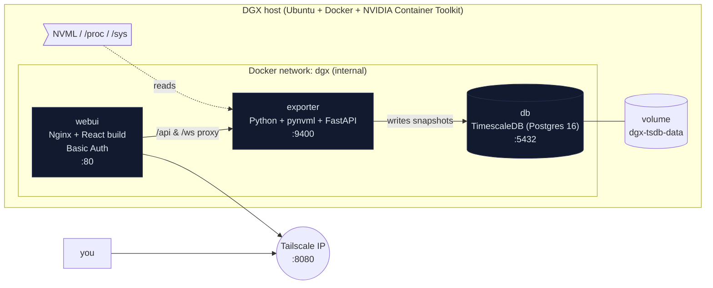
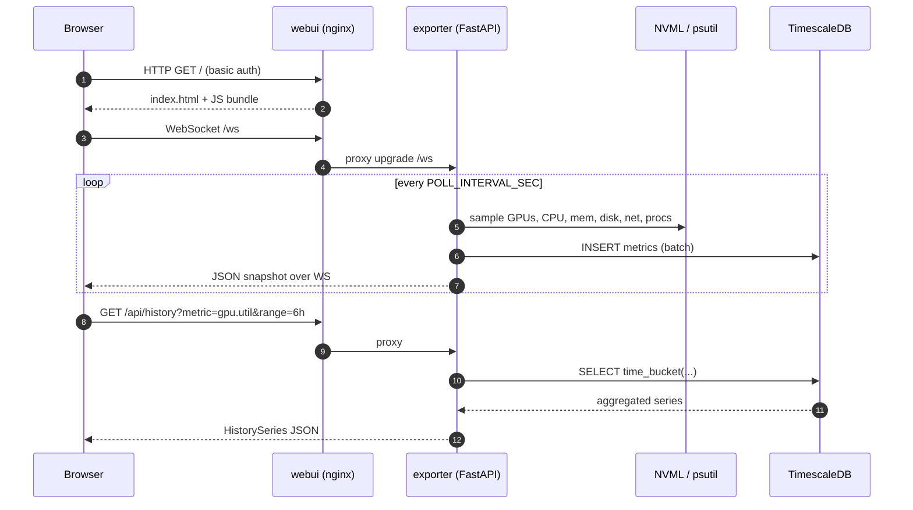
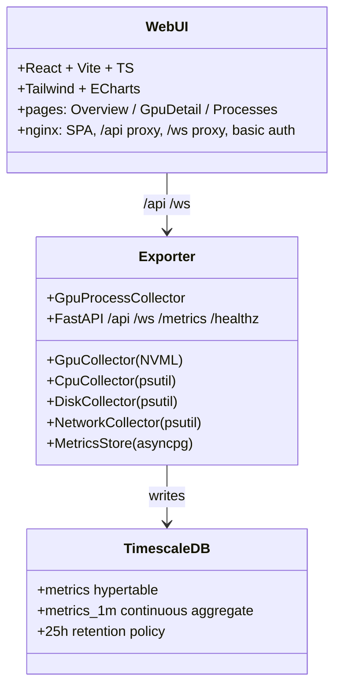

# tonic-dgxtop-web

Web dashboard for NVIDIA DGX systems — a companion to the [dgxtop](../README.md) Rust TUI.

- Same NVML-sourced metrics as `dgxtop` (GPU util, VRAM, temp, power, PCIe, clocks, ECC, throttle reasons) plus CPU / memory / disk / network.
- Live push over WebSocket, 24 h history via TimescaleDB.
- Three containers, all built locally. **Tailscale-only** by default; HTTP Basic Auth at the Nginx edge.

## Architecture



### Request flow — live update



### Component responsibilities



## Prerequisites on the DGX host

- Docker Engine ≥ 24
- [NVIDIA Container Toolkit](https://docs.nvidia.com/datacenter/cloud-native/container-toolkit/latest/install-guide.html) (`nvidia-ctk`)
- Tailscale running (`tailscale status`)

Everything else — Python, Node, Postgres — lives inside containers.

## Quick start

```bash
cd tonic-dgxtop-web

cp .env.example .env
# 1. Get your Tailscale IP:
tailscale ip -4 | head -1
# 2. Edit .env and set TAILSCALE_IP, BASIC_AUTH_PASSWORD, POSTGRES_PASSWORD.

docker compose build
docker compose up -d
docker compose ps
```

Open `http://<TAILSCALE_IP>:8080/` from another Tailscale device. Log in with the user/password you set in `.env`.

## Rotating the Basic Auth password

```bash
$EDITOR .env                                        # change BASIC_AUTH_PASSWORD
docker compose up -d --force-recreate webui         # regenerates htpasswd on start
```

## Endpoints (behind Basic Auth)

| Path | Description |
|---|---|
| `GET /` | React SPA |
| `GET /api/snapshot` | Latest snapshot JSON |
| `GET /api/history?metric=<m>&range=1h\|6h\|12h\|24h[&gpu_index=N][&device=X]` | Server-bucketed time series |
| `WS  /ws` | Live snapshot push (~1/s) |
| `GET /metrics` | Prometheus text exposition (via `/api/../metrics` if you add a scrape route; see notes) |
| `GET /healthz` | Health probe (no auth) |

Common `metric` values: `gpu.util`, `gpu.mem_pct`, `gpu.temp_c`, `gpu.power_w`, `gpu.pcie_tx_kbps`, `gpu.pcie_rx_kbps`, `gpu.sm_clock_mhz`, `cpu.util`, `cpu.temp_c`, `cpu.load1`, `mem.used_pct`, `disk.read_bps`, `disk.write_bps`, `disk.used_pct`, `net.rx_bps`, `net.tx_bps`.

## Data model

Single wide hypertable — cheap to add new metrics, no schema churn:

```sql
metrics(ts TIMESTAMPTZ, metric TEXT, gpu_index INT, device TEXT, value DOUBLE PRECISION)
```

- Chunk interval: 1 h
- Retention: 25 h (dgxtop-parity 24 h + 1 h buffer)
- Continuous aggregate `metrics_1m`: 1-minute avg/min/max, refreshed every minute

## Backup

```bash
./scripts/backup.sh          # writes backups/dgxtop-YYYYMMDD-HHMMSS.sql.gz
```

Restore:
```bash
gunzip -c backups/xxx.sql.gz | docker compose exec -T db psql -U dgx -d dgxtop
```

## Layout

```
tonic-dgxtop-web/
├── exporter/           Python 3.12 + pynvml + FastAPI service
│   ├── Dockerfile
│   ├── requirements.txt
│   └── app/
│       ├── main.py             FastAPI app + poll loop + WebSocket fan-out
│       ├── config.py           env-var settings
│       ├── models.py           pydantic snapshot schemas
│       ├── storage.py          asyncpg writer / reader
│       └── collectors/         gpu.py, system.py, process.py
├── webui/              React + Vite + TS SPA served by Nginx (auth proxy)
│   ├── Dockerfile              multi-stage (node build → nginx)
│   ├── nginx/                  conf template + entrypoint (htpasswd)
│   └── src/
│       ├── App.tsx             router shell
│       ├── main.tsx            React root
│       ├── index.css           Tailwind + panel styles
│       ├── api/client.ts       REST calls
│       ├── hooks/              useLiveSnapshot (auto-reconnect WS)
│       ├── components/         Header, GpuCard, LineChart, Gauge, format
│       ├── pages/              Overview, GpuDetail, Processes
│       └── types/api.ts        typed mirror of exporter models
├── db/init.sql         TimescaleDB hypertable + retention + CAgg
├── nginx/              (reserved for future edge configs)
├── scripts/backup.sh   pg_dump helper
├── docker-compose.yml  3-service stack, Tailscale-IP binding
├── .env.example        template — copy to .env
└── README.md
```

## Security notes

- Ports **not** published: exporter (9400), db (5432). Reachable only inside the `dgx` Docker network.
- Only `webui:80` is published, and only on `${TAILSCALE_IP}` — not `0.0.0.0`. `curl http://<lan-ip>:8080` from a non-Tailscale device will fail with "connection refused".
- HTTP Basic Auth is over unencrypted HTTP. Fine on Tailscale (WireGuard is doing the encryption). Do not expose to the internet without adding TLS.
- Secrets live in `.env` (gitignored, chmod 600). `docker inspect` reveals them to anyone with local shell — treat DGX shell access as trusted.

## Roadmap

- `POST /api/procs/{pid}/kill` — process kill from the UI (needs an auth-gated confirm dialog)
- NVLink topology view
- Alert rules → Notion / Slack via connector
- Grafana dashboard preset (points at the same DB)
